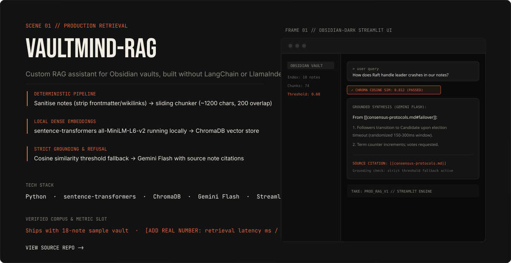
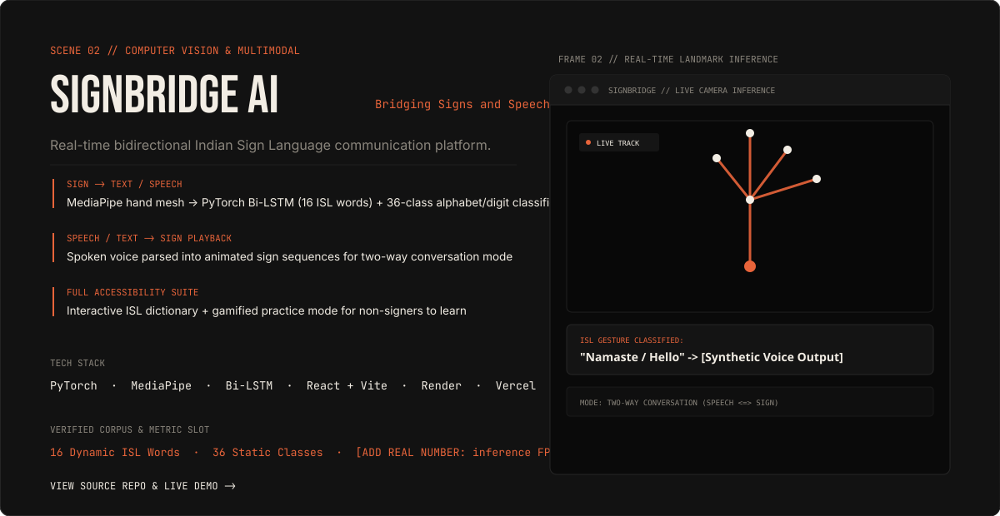

<!-- ================================================================= -->
<!-- SCENE 00 // HERO TITLE CARD                                       -->
<!-- ================================================================= -->

 

<!-- ================================================================= -->
<!-- ACT I // ABOUT                                                    -->
<!-- ================================================================= -->
Final-year B.E. student CSE(AI) at SVCE, graduating 2027. Building production-grade AI systems with raw Python, PyTorch, and deterministic pipelines without framework bloat. Actively seeking AI/ML Engineer and Data Analyst internships .

 

<!-- ================================================================= -->
<!-- ACT II // NOW SHOWING: FEATURED PRODUCTIONS                       -->
<!-- ================================================================= -->
## NOW SHOWING

 

<!-- 01: VAULTMIND-RAG -->

  &nbsp;↳&nbsp; <a href="https://github.com/rohanpawar0006/vaultmind-rag"><b>Repository</b></a>

 

<!-- 02: SIGNBRIDGE AI -->

  &nbsp;↳&nbsp; <a href="https://github.com/rohanpawar0006/SignBridge-AI"><b>Repository</b></a> &nbsp;·&nbsp; <a href="https://sign-bridge-ai-alpha.vercel.app/"><b>Live Demo</b></a>

 

<!-- ================================================================= -->
<!-- ACT III // TELEMETRY & CONTACT                                    -->
<!-- ================================================================= -->

 

  

  <a href="mailto:rohanpawar0006@gmail.com"><b>rohanpawar0006@gmail.com</b></a> &nbsp;·&nbsp;
  <a href="https://www.linkedin.com/in/rohan-pawar-bba78b290/"><b>LinkedIn</b></a> &nbsp;·&nbsp;
  <a href="https://github.com/rohanpawar0006"><b>GitHub</b></a>

