  <!-- ================================================================= -->
  <!-- HERO BANNER                                                       -->
  <!-- ================================================================= -->
  

   

  <!-- DYNAMIC TYPING SUBTITLE -->
  

   

  <!-- QUICK ACTION BUTTONS -->
  

    
    &nbsp;
    
    &nbsp;
    
  

  

<!-- ================================================================= -->
<!-- ABOUT ME                                                          -->
<!-- ================================================================= -->
## ◈ About Me

  

 

Final-year Computer Science student (**B.E. CSE(AI) at SVCE, graduating 2027**) specializing in **AI/ML engineering, computer vision, retrieval systems, and data-driven software**. 

Rather than wrapping pre-built libraries in black boxes, I focus on understanding the underlying mechanics — chunking behavior, loss surfaces, embedding geometry, retrieval threshold fallbacks, and real-time edge inference. My goal is to build intelligent systems that turn machine learning research into reliable, usable software.

**Open to AI/ML Engineer and Data Analyst internship opportunities.**

 

  

 

<!-- ================================================================= -->
<!-- CURRENT FOCUS                                                     -->
<!-- ================================================================= -->
## ⚡ What I'm Working On

<table width="100%">
  <tr>
    <td width="50%" valign="top">
      <h4>🤖 AI Engineering</h4>
      
Building deterministic RAG pipelines, autonomous LLM agents, and semantic retrieval systems engineered without framework bloat.

    </td>
    <td width="50%" valign="top">
      <h4>👁️ Computer Vision</h4>
      
Real-time hand mesh tracking, PyTorch sequence modeling (Bi-LSTM), and on-device classification for human-computer interaction.

    </td>
  </tr>
  <tr>
    <td width="50%" valign="top">
      <h4>📊 Data &amp; Analytics</h4>
      
Structuring end-to-end data pipelines, exploratory analytics, statistical modeling, and interactive reporting dashboards.

    </td>
    <td width="50%" valign="top">
      <h4>🧠 Problem Solving &amp; DSA</h4>
      
Systematically practicing data structures, algorithmic complexity, and coding interview patterns across LeetCode &amp; NeetCode.

    </td>
  </tr>
</table>

 

  

 

<!-- ================================================================= -->
<!-- FEATURED PROJECTS                                                 -->
<!-- ================================================================= -->
## 🚀 Featured Projects

<table>
  <!-- PROJECT 1: SIGNBRIDGE AI -->
  <tr>
    <td>
      
      

        
        &nbsp;
        
        &nbsp;
        
        &nbsp;
        
      

      <ul>
        <li><b>Problem:</b> Communication barrier between Indian Sign Language (ISL) users and spoken-language users in everyday environments.</li>
        <li><b>Approach:</b> Real-time landmark extraction via MediaPipe Hand Mesh &rarr; temporal sequence modeling with a PyTorch Bi-LSTM &rarr; speech generation, paired with reverse speech-to-sign animated playback.</li>
        <li><b>Technology:</b> Python · PyTorch · Bi-LSTM · MediaPipe · OpenCV · React (Vite) · FastAPI · WebSockets · Web Speech API</li>
        <li><b>Result:</b> Full bidirectional communication platform recognizing 16 dynamic ISL gestures + an on-device 36-class classifier for static alphabets and digits, featuring an interactive ISL dictionary and gamified practice mode.</li>
      </ul>
    </td>
  </tr>

  <!-- PROJECT 2: VAULTMIND-RAG -->
  <tr>
    <td>
       
      
      

        
      

      <ul>
        <li><b>Problem:</b> Standard RAG frameworks (LangChain / LlamaIndex) hide chunking behavior, embedding distance dynamics, and hallucination failure modes behind heavy abstractions.</li>
        <li><b>Approach:</b> Built from scratch using raw primitives: markdown sanitization &rarr; custom sliding-window chunker (~1200 chars, 200 overlap) &rarr; local dense embeddings (`all-MiniLM-L6-v2`) &rarr; ChromaDB vector store &rarr; cosine similarity with a strict relevance threshold fallback &rarr; grounded prompt synthesis &rarr; Gemini Flash.</li>
        <li><b>Technology:</b> Python · sentence-transformers · ChromaDB · Gemini Flash · Streamlit · Vector Embeddings</li>
        <li><b>Result:</b> Deterministic RAG engine for Obsidian vaults that provides clickable markdown source citations (`[[note#header]]`) and explicitly declines to answer when context is insufficient, preventing hallucinations.</li>
      </ul>
    </td>
  </tr>

  <!-- PROJECT 3: RESEARCH BRIEF AGENT -->
  <tr>
    <td>
       
      
      

        
      

      <ul>
        <li><b>Problem:</b> LLM research workflows frequently produce unstructured, unverifiable outputs that hallucinate when queried about obscure or non-existent entities.</li>
        <li><b>Approach:</b> Multi-stage research pipeline with an explicit <b>Low-Confidence Degradation Path</b>. Ingests topics and enforces a strict 4-part brief schema (`Summary`, `Key Points`, `Sources`, `Confidence Note`). If evidence is thin or conflicting, it halts generation and emits a low-confidence alert instead of fabricating data.</li>
        <li><b>Technology:</b> TypeScript · React · Vite · Gemini API · Search Grounding · Tailwind CSS</li>
        <li><b>Result:</b> Production-ready research automation dashboard with 1-click evaluator benchmarks and Markdown/JSON export capabilities.</li>
      </ul>
    </td>
  </tr>

  <!-- PROJECT 4: FUNDNEST -->
  <tr>
    <td>
       
      
      

        
      

      <ul>
        <li><b>Problem:</b> Creators struggle to draft compelling campaign pitches, while prospective backers face lengthy narrative walls without quick decision metrics.</li>
        <li><b>Approach:</b> Full-stack crowdfunding platform integrating Google Gemini API to power an AI Campaign Assistant (generates structured titles and stories from rough ideas) and an AI Story Summarizer (condenses campaign stories for backers).</li>
        <li><b>Technology:</b> React · Tailwind CSS · Vite · Node.js · Express · MongoDB · JWT Authentication · Gemini API</li>
        <li><b>Result:</b> Complete end-to-end web platform featuring secure user authentication, campaign discovery, personal creator dashboards, and AI copywriting assistants.</li>
      </ul>
    </td>
  </tr>
</table>

 

  

 

<!-- ================================================================= -->
<!-- TECH STACK                                                        -->
<!-- ================================================================= -->
## 🛠️ Technical Stack

### Languages

  
  
  
  

### AI &amp; Machine Learning

  
  
  
  
  
  

### LLM &amp; AI Engineering

  
  
  
  
  

### Data &amp; Analytics

  
  
  
  
  

### Backend &amp; Web

  
  
  
  
  
  

### Tools &amp; Workflow

  
  
  
  
  

 

  

 

<!-- ================================================================= -->
<!-- ENGINEERING INTERESTS                                             -->
<!-- ================================================================= -->
## 🧠 Areas I'm Exploring

<table width="100%">
  <tr>
    <td width="33.3%" align="center">
      <b>👁️ Computer Vision</b> 
      Edge gesture inference &amp; spatial tracking
    </td>
    <td width="33.3%" align="center">
      <b>🔍 Grounded RAG</b> 
      Threshold fallback &amp; citation-anchored retrieval
    </td>
    <td width="33.3%" align="center">
      <b>🤖 AI Agents</b> 
      Multi-step planning &amp; anti-hallucination guardrails
    </td>
  </tr>
  <tr>
    <td width="33.3%" align="center">
      <b>💬 Applied NLP</b> 
      Dense embeddings &amp; sequence modeling
    </td>
    <td width="33.3%" align="center">
      <b>📈 Data Analytics</b> 
      Predictive modeling &amp; analytical dashboards
    </td>
    <td width="33.3%" align="center">
      <b>⚡ Intelligent Interfaces</b> 
      Low-latency WebSockets &amp; real-time interaction
    </td>
  </tr>
</table>

 

  

 

<!-- ================================================================= -->
<!-- DSA / LEARNING                                                    -->
<!-- ================================================================= -->
## 📚 Problem Solving &amp; Core CS

<table width="100%">
  <tr>
    <td>
      
I practice data structures and algorithms consistently to build strong analytical fundamentals and coding interview readiness.

      <ul>
        <li><b>Active Topics:</b> Arrays, Sliding Window, Two Pointers, Trees, Graphs, and Dynamic Programming.</li>
        <li><b>Solutions Repository:</b> <a href="https://github.com/rohanpawar0006/Leetcode-Submissions"><b>rohanpawar0006/Leetcode-Submissions</b></a> (curated solutions auto-synced from NeetCode / LeetCode).</li>
        <li><b>Supporting Practice:</b> <a href="https://github.com/rohanpawar0006/Python-Practice"><b>rohanpawar0006/Python-Practice</b></a> (core Python idioms, algorithms &amp; foundational scripts).</li>
      </ul>
    </td>
  </tr>
</table>

 

<!-- ================================================================= -->
<!-- CURRENT LEARNING                                                  -->
<!-- ================================================================= -->
## 🎯 Continuous Growth

Currently sharpening my technical foundations across:

- **Machine Learning Fundamentals:** Mathematical foundations for ML (linear algebra, calculus, probability &amp; optimization).
- **Advanced RAG Architectures:** Hybrid search (BM25 + dense vectors), reranking models (Cohere/Cross-Encoder), and agentic query routing.
- **Production AI Deployment:** Model quantization, ONNX runtime edge inference, and latency benchmarking.
- **System Design &amp; DSA:** High-throughput backend architecture and algorithmic efficiency.

 

  

 

<!-- ================================================================= -->
<!-- GITHUB ACTIVITY & SNAKE                                           -->
<!-- ================================================================= -->
## 📊 Activity &amp; Telemetry

  <table>
    <tr>
      <td align="center">
        
      </td>
      <td align="center">
        
      </td>
    </tr>
  </table>

   

  <!-- Contribution Grid Snake -->
  <picture>
    <source media="(prefers-color-scheme: dark)" srcset="https://raw.githubusercontent.com/rohanpawar0006/rohanpawar0006/output/github-contribution-grid-snake-dark.svg" />
    
  </picture>

 

  

 

<!-- ================================================================= -->
<!-- CONNECT & CLOSING                                                 -->
<!-- ================================================================= -->
## 🌐 Connect With Me

  <b>I am actively seeking AI/ML Engineer and Data Analyst internship opportunities.</b> 
  <i>Looking for an engineer who turns AI concepts into working systems and understands the code from first principles? Let's talk.</i>

  
  &nbsp;&nbsp;
  
  &nbsp;&nbsp;
  

 

  

