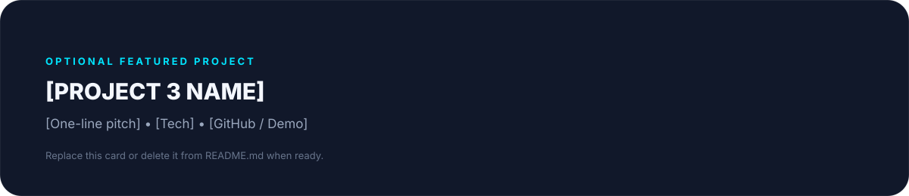

  

  

  
  
  

## ◈ ABOUT ME

<table width="100%">
<tr><td>

**Final-year B.E. student in CSE(AI) at SVCE, graduating 2027.** I build practical AI systems across **RAG, computer vision, intelligent agents, and data analytics** — with an emphasis on understanding the underlying mechanics instead of hiding everything behind frameworks.

Currently building deeper skills in **production-grade AI, retrieval systems, ML engineering, and analytics workflows**. **Open to AI/ML internship opportunities** where I can ship, learn, and contribute to real products.

</td></tr>
</table>

## ◈ FEATURED PROJECTS

### 01 — VaultMind-RAG

> **Custom RAG assistant for Obsidian vaults — intentionally built without LangChain to demonstrate the mechanics behind retrieval-augmented generation.**

**Pipeline:** note sanitizing → custom sliding-window chunking → local `all-MiniLM-L6-v2` embeddings → ChromaDB → cosine similarity + threshold fallback → strict grounding prompt → Gemini Flash.

**What makes it interesting:** source citations, grounded answers, refusal when relevant context is unavailable, and a focused Obsidian-dark Streamlit interface.

**[Repository →](https://github.com/rohanpawar0006/vaultmind-rag)**

<!-- SCREENSHOT SLOT: Replace the path below with the real image. Recommended: assets/screenshots/vaultmind-rag.png -->
<!-- Screenshot to capture: full Streamlit chat UI showing a question, grounded answer, and visible source citations. -->

### 02 — SignBridge AI

> **Real-time bidirectional Indian Sign Language communication platform — bridging signs and speech.**

**Sign → text/voice:** MediaPipe hand landmarks + PyTorch Bi-LSTM across 16 ISL signs, plus an on-device 36-class alphabet/digit classifier. **Speech/text → sign:** sign playback and conversational flow, with live two-way conversation, interactive ISL dictionary, and gamified practice mode.

**Stack:** React/Vite frontend on Vercel + backend on Render.

**[Repository →](https://github.com/rohanpawar0006/SignBridge-AI) · [Live Demo →](https://sign-bridge-ai-alpha.vercel.app/)**

<!-- SCREENSHOT SLOT: Replace the path below with the real image. Recommended: assets/screenshots/signbridge-ai.png -->
<!-- Screenshot to capture: live conversation screen showing sign recognition/output, ideally with the camera/landmark visualization visible. -->

### 03 — Optional

<!-- Replace this card with your third project, or delete this section. -->

## ◈ TECH STACK

### Languages

  
  
  
  

### AI / ML

  
  
  
  
  
  
  
  

### Data & Analytics

  
  
  
  
  
  

### Web / Deploy

  
  
  
  
  
  
  

### Tools

  
  
  
  
  

## ◈ GITHUB ACTIVITY

  
  

  

<!-- If a public stats service is rate-limited, the profile still remains fully readable; the cards above are supplemental. -->

## ◈ CONTRIBUTION SNAKE

  <picture>
    <source media="(prefers-color-scheme: dark)" srcset="https://raw.githubusercontent.com/rohanpawar0006/rohanpawar0006/output/github-contribution-grid-snake-dark.svg" />
    <source media="(prefers-color-scheme: light)" srcset="https://raw.githubusercontent.com/rohanpawar0006/rohanpawar0006/output/github-contribution-grid-snake.svg" />
    
  </picture>

## ◈ CONNECT

  
  
  <!-- Add portfolio later:  -->

<strong>OPEN TO AI/ML INTERNSHIPS</strong> · AI/ML Engineering · RAG · Computer Vision · Data Analytics

  

  

<!--
SCREENSHOT CHECKLIST
1. assets/screenshots/vaultmind-rag.png — 1280x720 recommended: Streamlit chat + answer + source citations.
2. assets/screenshots/signbridge-ai.png — 1280x720 recommended: live conversation/camera + recognition output.
3. Optional: assets/screenshots/project-3.png — only if Project 3 is added.

SKILL NOTE
Every skill in the grid was explicitly confirmed for this README. C++/Java/Tailwind CSS were intentionally omitted because they were not confirmed in the final skill list.
-->
