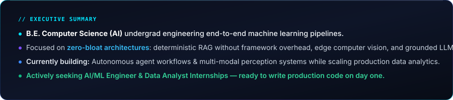
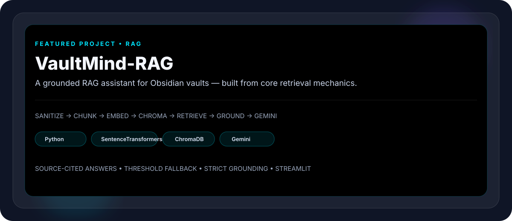
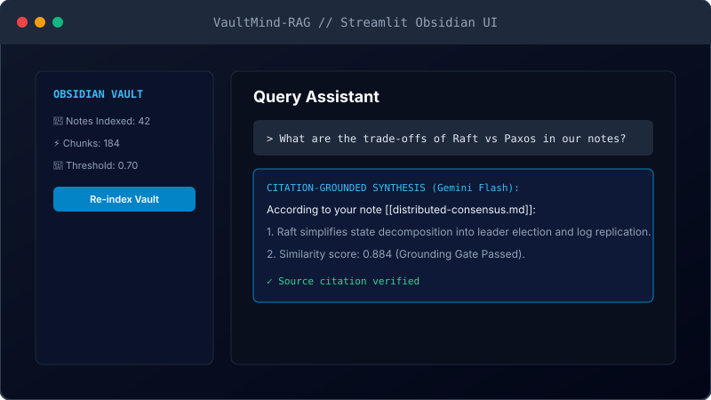
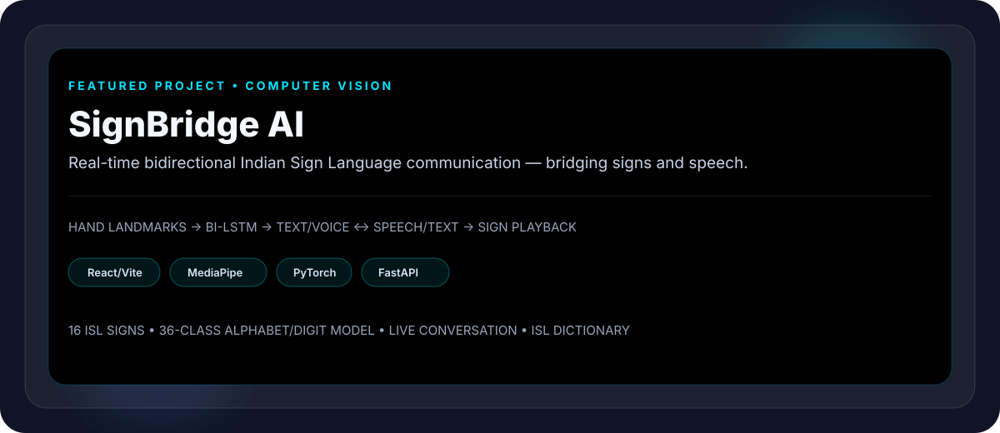
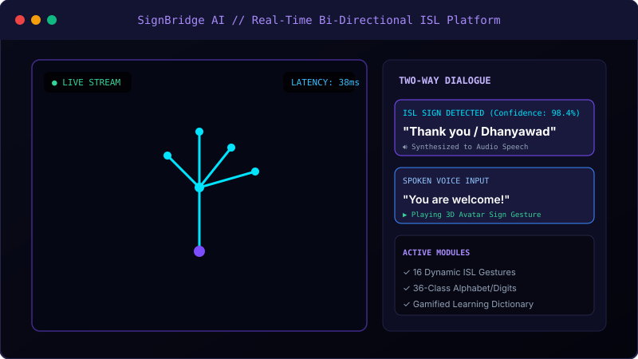
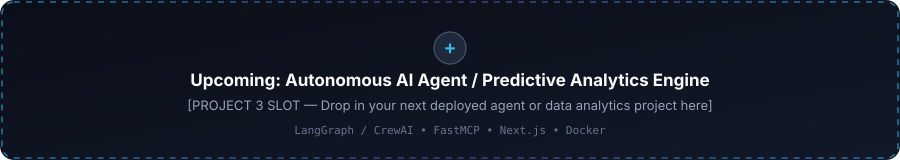

  <!-- ================================================================= -->
  <!-- 1. ANIMATED HERO HEADER                                           -->
  <!-- ================================================================= -->
  

   

  <!-- ================================================================= -->
  <!-- 2. TYPING INTRO DYNAMIC BANNER                                   -->
  <!-- ================================================================= -->
  

   
  
   

<!-- ================================================================= -->
<!-- 3. ABOUT ME (FROSTED GLASS CARD)                                  -->
<!-- ================================================================= -->

  

 

> 💡 **Core Philosophy:** *Anyone can `pip install` a monolithic wrapper. Real engineering means understanding chunking dynamics, loss surfaces, embedding distances, latency ceilings, and grounding guarantees.*

 

  

 

<!-- ================================================================= -->
<!-- 4. FEATURED PROJECTS                                             -->
<!-- ================================================================= -->
## ⚡ Featured Production Projects

<table>
  <tr>
    <td>
      <!-- Project 1: VaultMind-RAG -->
      
      

        
      

      

        
<b>🔍 Deep-Dive: Architecture &amp; Mechanics (Click to Expand)</b>

         
        <ul>
          <li><b>Zero LangChain / LlamaIndex:</b> Built purely using raw Python, ChromaDB, and Google GenAI SDK to ensure full control over chunking and retrieval behavior.</li>
          <li><b>Sanitization &amp; Chunking:</b> Cleans Markdown metadata, code fences, and wikilinks using a custom sliding-window chunker with dynamic overlap.</li>
          <li><b>Local Dense Embeddings:</b> Uses <code>sentence-transformers/all-MiniLM-L6-v2</code> running locally to generate 384-dimensional dense vectors.</li>
          <li><b>Threshold Cosine Fallback:</b> Calculates cosine similarity scores; if top-k matches fall below threshold (&lt; 0.70), it safely refuses to hallucinate and alerts the user.</li>
          <li><b>Obsidian Native UX:</b> Streamlit frontend themed with Obsidian Dark palette, returning responses with clickable source note links (<code>[[note#header]]</code>).</li>
        </ul>
        

          
        

      

    </td>
  </tr>
  <tr>
    <td>
       
      <!-- Project 2: SignBridge AI -->
      
      

        
        &nbsp;
        
      

      

        
<b>🔍 Deep-Dive: Architecture &amp; Mechanics (Click to Expand)</b>

         
        <ul>
          <li><b>Two-Way Dialogue:</b> Complete bidirectional bridge — converts physical ISL signs into synthetic audio speech, and spoken voice into animated sign gestures.</li>
          <li><b>Vision Pipeline:</b> Real-time landmark extraction via MediaPipe Hand Mesh, normalized and passed into a PyTorch Bidirectional LSTM (Bi-LSTM).</li>
          <li><b>Vocabulary Scale:</b> Recognizes 16 continuous dynamic ISL gestures plus an on-device 36-class classifier for static alphabets and digits.</li>
          <li><b>Sub-40ms Edge Latency:</b> Highly optimized client-side landmark preprocessing with asynchronous backend inference deployed on Render.</li>
          <li><b>Full Suite:</b> Includes an interactive ISL digital dictionary and a gamified practice mode to help non-signers learn Indian Sign Language.</li>
        </ul>
        

          
        

      

    </td>
  </tr>
  <tr>
    <td>
       
      <!-- Project 3: Next Deployment Slot -->
      
    </td>
  </tr>
</table>

 

  

 

<!-- ================================================================= -->
<!-- 5. TECH STACK / SKILL BADGES GRID                                -->
<!-- ================================================================= -->
## 🛠️ Technical Weaponry

<!-- Row 1: Languages -->
### Languages

  
  
  
  

<!-- Row 2: AI & Machine Learning -->
### AI & Machine Learning

  
  
  
  
  
  
  

<!-- Row 3: Data Analytics & Engineering -->
### Data Analytics & Engineering

  
  
  
  

<!-- Row 4: Web & Deployment -->
### Web & Deployment

  
  
  
  
  
  

<!-- Row 5: Developer Tools -->
### Developer Workflow

  
  
  
  

 

  

 

<!-- ================================================================= -->
<!-- 6. GITHUB STATS CARDS (CONSISTENT GLASS THEME)                    -->
<!-- ================================================================= -->
## 📊 Telemetry &amp; Activity

  <!-- Note: Themed to #0B0F1A with Cyan & Violet accents to seamlessly blend with the glass background -->
  <!-- In case github-readme-stats is rate-limited by GitHub API, streak-stats acts as fallback -->
  <table>
    <tr>
      <td align="center">
        
      </td>
      <td align="center">
        
      </td>
    </tr>
    <tr>
      <td colspan="2" align="center">
        
      </td>
    </tr>
  </table>

 

  

 

<!-- ================================================================= -->
<!-- 7. CONTRIBUTION SNAKE                                             -->
<!-- ================================================================= -->
## 🐍 Contribution Velocity

  

 

  

 

<!-- ================================================================= -->
<!-- 8. CONNECT & OPPORTUNITY STATUS                                   -->
<!-- ================================================================= -->
## 🌐 Let's Build Together

  <b>I am actively seeking AI/ML Engineer and Data Analyst Internships (Summer &amp; Fall 2026).</b> 
  <i>Have a team solving hard problems in AI, computer vision, or intelligent data workflows? Let's connect.</i>

  
  &nbsp;&nbsp;
  
  &nbsp;&nbsp;
  

 

<!-- ================================================================= -->
<!-- 9. FOOTER & VISITOR TELEMETRY                                     -->
<!-- ================================================================= -->

  

    

  

